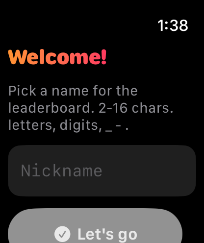

# PixelHop

A Mario-style 2D platformer **for Apple Watch**, with an online global leaderboard.

> Built for the wrist. Single-finger controls. 60fps. Offline-first.


## Status

- ✅ **Backend** deployed and live at `https://applewatch-mario-api.72.62.0.34.sslip.io` (valid Let's Encrypt cert) — passes the full E2E test suite (`tools/test-api.sh`).
- ✅ **Watch app** builds for watchOS 26.4 simulator (Apple Watch Series 11 46mm), launches, and renders the onboarding screen:

  <p align="center"></p>

- ⏳ **Physical-watch sideload** is yours to do — open `apps/watch/PixelHop.xcodeproj`, sign with your free Apple ID under Signing & Capabilities, then run on a paired watch (`⌘R`).

## What's in the box

- **`apps/watch/`** — the watchOS app (SwiftUI + SpriteKit). Standalone watch app — no companion iPhone app required.
- **`services/api/`** — the leaderboard backend (Bun + Hono + Drizzle + Postgres). Runs at `https://applewatch-mario-api.72.62.0.34.sslip.io`.
- **`tools/`** — Coolify provisioning + redeploy helpers.

## Controls

Designed for one-handed wear-and-play:

- **Drag horizontally** on the bottom of the screen → move left / right (analog joystick)
- **Flick the same finger upward** → jump (variable height = flick magnitude)
- **Crown press** → pause
- **Crown rotate forward** → use power-up (when held)
- **Crown** → scroll leaderboards / menus

No on-screen left/right buttons. No two-finger gestures. The watch stays on your wrist.

## Architecture at a glance

```
[ Watch app ] — async/await + HMAC ⇒ [ Hono + Bun on Coolify ] — Drizzle ⇒ [ Postgres ]
     ↑                                                                          ↓
     └────────────── score submission, leaderboard reads ─────────────────────┘
```

- The watch generates a per-device UUID + secret on first launch (Keychain). All score submissions are HMAC-signed with that secret.
- The backend tracks scores per level and globally; replay protection via nonces with TTL.
- Game logic is 100% local — leaderboard is the only network dependency. Offline play queues scores locally and flushes on next online launch.

## Build & run

### Backend (local dev)
```bash
cd services/api
bun install
bun --hot src/index.ts
```

### Watch app (requires Xcode 16+ on macOS 14+)
```bash
cd apps/watch
xcodegen generate          # creates PixelHop.xcodeproj from project.yml
open PixelHop.xcodeproj
# Pick "PixelHop Watch App" scheme → run on simulator or paired watch
```

### Deploy backend to Coolify
```bash
git push origin main
./tools/coolify-deploy.sh   # ⚠ pushes do NOT auto-deploy on this VPS — always run this
```

## Documentation

- [`ARCHITECTURE.md`](ARCHITECTURE.md) — module map, per-frame data flow, HMAC protocol, why we don't use SKPhysicsBody
- [`DEPLOY.md`](DEPLOY.md) — Coolify backend deployment + watch app sideload setup, including the *manual deploy after every push* gotcha
- [`CONTRIBUTING.md`](CONTRIBUTING.md) — how to add a new level, full tile alphabet, headless typecheck workflow
- [`services/api/SECURITY.md`](services/api/SECURITY.md) — HMAC threat model, replay protection, score caps

## License

Code: MIT. Art assets: CC0 (Kenney Pixel Platformer pack v1.2 — see `apps/watch/PixelHop/Resources/Sprites/Kenney-License.txt`). PixelHop is original IP — not affiliated with Nintendo or any other rights holder.
